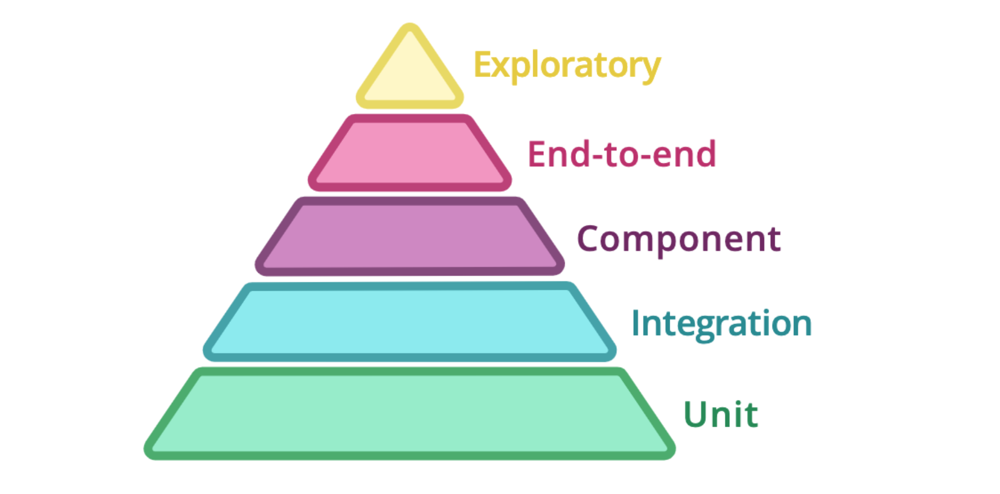
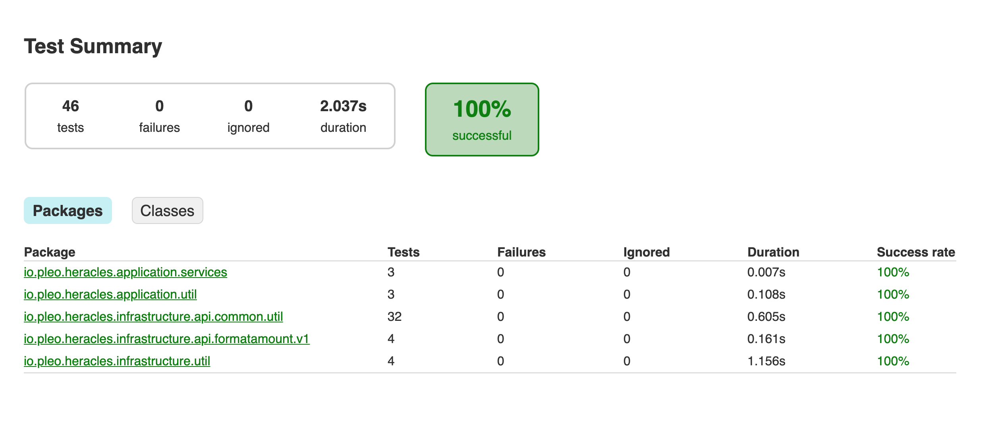
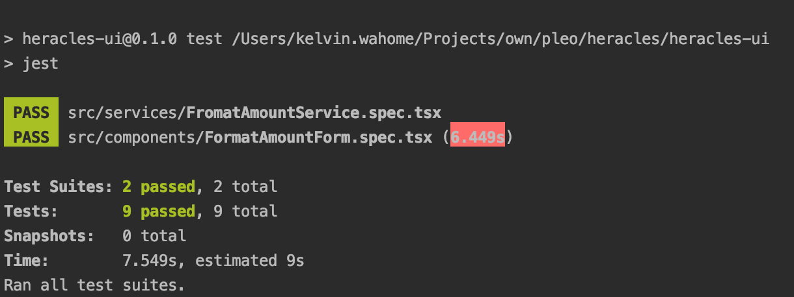
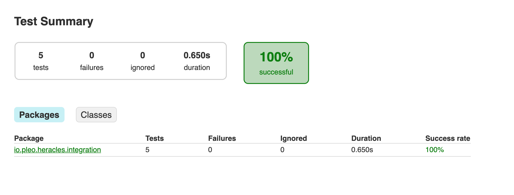
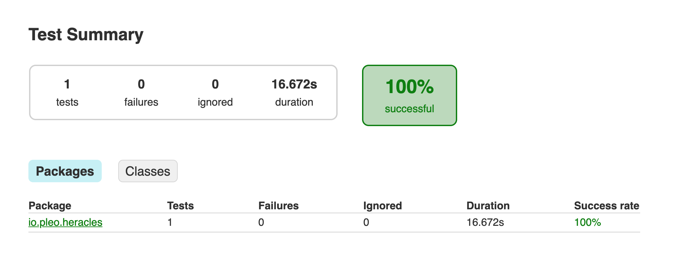

**Heracles**
[](https://circleci.com/gh/kwahome/heracles)
[](https://codeclimate.com/github/kwahome/heracles/maintainability)

Heracles is a web app exposing an API that takes in user amount input and converts into a string format.
It's fronted by a UI that captures the inputs from the user and submits to the backend.


A swagger contract documenting the v1 API can be found at:

```heracles-api/definitions/api/v1/format_amount_1.yml```

**API design**

Below is an example API request body:

```json
{
	"header": {
		"messageId": "c1a2c8c7-0465-4ec1-a8fb-3a1b58922548",
		"timestamp": "2019-11-07T19:36:14.049467Z"
	},
	"amount": {
		"currency": "KES",
		"value": 100000,
		"precision": 2
	},
	"locale": "en",
	"decimalPlaces": 2,
	"thousandsSeparator": ",",
	"decimalSeparator": "."
}
```

For purposes of internationalization, an `Amount` object is used to represent money. It bears three fields:
- `currency` - the currency
- `value` - the amount of money that is in minor currency units
- `precision` - the conversion precision for use in converting minor to major units

`locale` is an optional field that can be passed in to customize how money is formatted. A supplied locale is checked
against known locales and if found, a number format is derived from it. `decimalPlaces` represents the rounding off
precision that applies, `thousandsSeparator` is the grouping separator character while `decimalSeparator` is the
character used to separate decimals. They are all optional with defaults used if not supplied.

An example success response from this API:

```json
{
    "header": {
        "messageId": "6427d576-5038-4aaa-a02d-dedf9e636b96",
        "timestamp": "2019-11-20T12:53:52.665058Z",
        "responseStatus": {
            "status": "SUCCESS"
        },
        "groupId": "c1a2c8c7-0465-4ec1-a8fb-3a1b58922548"
    },
    "formattedAmount": "KES 1,000.00"
}
```

**Tech stack**
- Programming language(s) : Kotlin, Typescript, React
- Backend Framework : Spring Boot
- Frontend Framework : React JS
- UI theme & design : Material UI
- Containerization : Docker
- Continuous Integration pipeline : CircleCI
- Static analysis tool : Code Climate
- Linting : kotlinter (Kotlin), eslint (Typescript/React)
- Unit tests : JUnit (backend), jest(frontend)
- Integration tests : JUnit
- End to end tests : Kotlin with Selenium WebDriver
- API documentation : Swagger

**Type of tests**

Various types of automated tests targeting different aspects and goals of testing have been written for this challenge.
Generally, the test pyramid has been following towards this end with a huge percentage of these tests being unit tests
as they are cheap to write and fast to run.



Below are the kinds of tests employed:

**1. Unit tests**

Testing the smallest testable part of both the backend and front end, these have been added to affirm
correctness of these building blocks. They are meant to be fast as they mock out dependencies.

`JUnit` is used as the test framework and `mockk` for mocking out and spying on various dependencies for backend
unit tests while `jest` is used on the front end. `jacoco` has been integrated for test metrics reporting.

To run these tests use:

`gradle test` on the kotlin backend. A `jacoco` test report will be generated and stored in the path
`/heracles/heracles-api/build/reports/tests/test/index.html`.



and `npm run test` on the react frontend. 


    
Make sure to be on the correct directory
    
    
Unit tests form the bulk of tests written here as they are cheap in effort and cover more contained scopes.

**2. Integration tests**

These test the integration and working together of various components. They are more 
expensive to write and are slower to run hence their isolation from unit tests because typically dependencies are not
mocked in these kind of tests as the intention is test workflow scenarios.

For the backend, these tests are located in an `integration` directory of the test package. Integration tests here have 
been written with the help of SpringBootTest and configuration of random web ports. An improvement here is the
application of test containers to set up a reusable integration test framework.
    
To run these tests, use:
    
`gradle integrationTest`. A `jacoco` test report will be generated and stored in the path 
`/heracles/heracles-api/build/reports/tests/integrationTest/index.html`



Make sure to be on the correct directory.

**3. End to End tests**

These are used to test whether the flow of an application is performing as designed from start to finish validating
not only the software system under test but also checks its integration with external interfaces.

In our case, the UI collects user inputs via html forms, does some client side validates, submits to the backend via the
exposed API and renders the response. And end to end flow thus involves the two components talking to each other.
Scenarios are then generated and scripted as repeatable.

Since these are "higher level" tests that are not coupled to the structure or technology of specific aspects of the 
software system under test but rather are concerned about it's behaviour, they can be coded in isolation allowing
choices in technologies to use.

These kinds of test are also the most significant targets of test automation as they have been mostly coupled into
exploratory testing by most people.

The directory `heracles-e2e-tests` has been created to house all the code used to achieve end to end testing. End to
end tests for this challenge are written using `kotlin` and `selenium web driver` and `junit` testing framework.
`Page Object Model` design pattern is applied to encourage more looser coupling and reduce code duplication.

To run these tests, use:

`gradle test`. A `jacoco` test report will be generated and stored in the path 
`/heracles/heracles-e2e-tests/build/reports/tests/test/index.html`



Make sure to be on the correct directory and have both the backend and frontend applications running and env variable
name `HERACLES_HOST` (the front end application host) set correctly.

**4. Linting**

> Code is read more than it is written 

Code quality includes use of best practices that are enforced by language specific linters. 
The have been integrated into both kotlin (`kotlinter`) and typescript/react (`eslint`) code bases and configured to
flag violations

To run these linting, use:

`gradle check` on the kotlin backend and `npm run lint` on the react frontend. 

Make sure to be on the correct directory
        
**Build pipeline**

CircleCI is the build pipeline tool in use.
Its configuration can be found at `.circleci/config.yml`.
Tests and checks described above have all been wired up as parallelized jobs on this pipeline for optimized
performance.
    
**Enhancements**

- Dockerization for dev/staging/test/prod environment parity which ensures that runtimes are similar hence reducing
regression from misconfiguration risks.
- Use of test containers to set up a configurable and reusable integration test framework. Cloud dependencies can be
configured with their respective simulators where applicable
- More types of tests targeting different aspects of the application lifecycle can be added in for a wider coverage. 
Load and performance tests that provide an indication of how the application would perform under load are one such 
example. Another is traffic shadowing which is a release process test.
- Metrics and logging for better observability. Metrics and traces augments testing as it provides the means of 
validating some of the observations being made.
- Integrating code climate with test reports generated and adding checks on it.
